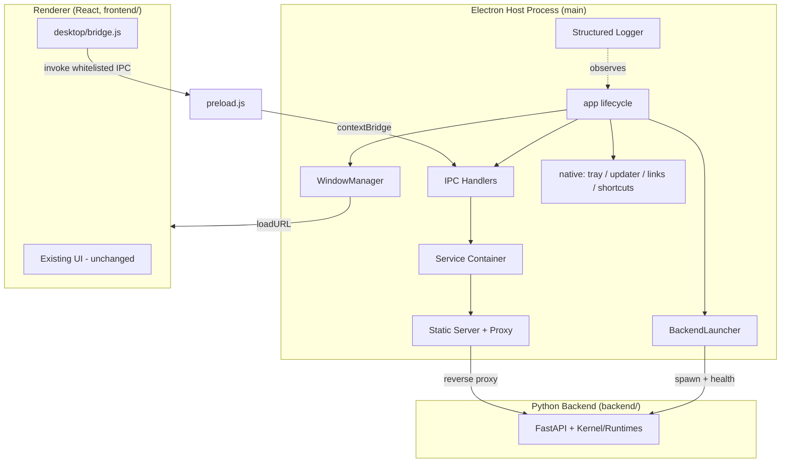
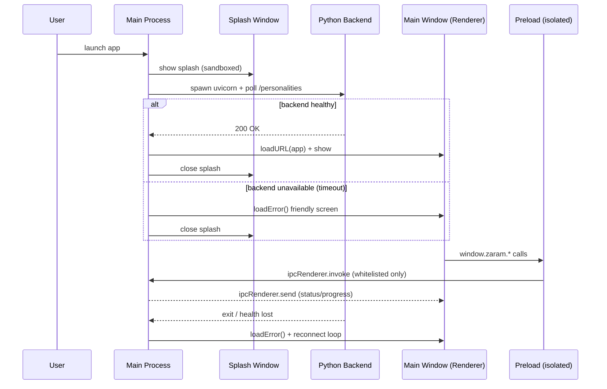

# Zaram — Electron Desktop Foundation (v0.7.0)

**Milestone scope:** Architectural migration from a React web app to a
production-ready Electron desktop host. No UI redesign; existing frontend and
backend behaviour preserved.

---

## 1. Architecture Summary

Zaram is now hosted by an Electron application that launches the existing React
frontend and the existing Python backend as child processes. The desktop host
is organised around three process layers (main, preload, renderer) with a
strict, whitelisted IPC boundary. Desktop capabilities are exposed through a
dependency-injected **service layer** so future runtimes (UI, Orb, Character,
Garage, Project) can consume them without rework.

Key properties:

- **Context isolation + sandboxed splash/error windows.** The renderer never
  gets Node.js, `require`, or raw `fs`. It only sees a curated `window.zaram`.
- **Whitelisted IPC.** A single channel catalogue (`ipc/channels.js`) is the
  source of truth; the preload may only invoke `RENDERER_INVOKABLE` channels.
- **Same-origin backend access.** In dev the Vite proxy, in prod a built-in
  static server + reverse proxy, both forward API traffic to the backend. No
  CORS, no backend changes, backend hidden from arbitrary web origins.
- **Resilient backend lifecycle.** Electron spawns the backend, health-checks
  it, shows a friendly error screen if unavailable, and reconnects on failure.
- **Platform-aware paths.** Logs, settings, window state, and sandbox FS roots
  use the OS user-data directory; no hardcoded paths.
- **Structured logging, no `print()`.** JSON-line logger to user-data logs.

---

## 2. Files Created

**Electron core**
- `electron/main.js` — app entry: lifecycle, window, backend, IPC, native wiring, graceful shutdown.
- `electron/preload.js` — secure `contextBridge` exposing `window.zaram` (whitelisted).
- `electron/config.js` — dev/prod config + platform-aware paths (no `electron` import, unit-testable).
- `electron/logger.js` — structured JSON logger.
- `electron/staticServer.js` — prod static server + backend reverse proxy.
- `electron/types.js` — JSDoc service contracts.

**IPC**
- `electron/ipc/channels.js` — channel catalogue + `RENDERER_INVOKABLE` whitelist + main→renderer events.
- `electron/ipc/handlers.js` — channel → service handler registry.

**Backend lifecycle**
- `electron/backend/backendLauncher.js` — spawn, health-check, reconnect, events.
- `electron/backend/health.js` — health probe.

**Window management**
- `electron/window/windowManager.js` — main window, state persistence, error state.
- `electron/window/windowState.js` — pure load/save/clamp of geometry.
- `electron/window/splash.js` + `electron/window/assets/splash.html` — sandboxed splash.
- `electron/window/assets/error.html` — friendly backend-unavailable screen.

**Desktop services**
- `electron/services/index.js` — DI container.
- `electron/services/{settingsService,downloadService,windowService,notificationService,shellService,fileDialogService,fileSystemService}.js`

**Native abstractions (foundations)**
- `electron/native/{tray,autoUpdater,fileAssociations,deepLinks,globalShortcuts}.js`

**Packaging / docs / tests**
- `electron/electron-builder.yml` — Windows NSIS installer + portable.
- `electron/README.md` — developer guide.
- `test/{config,windowState,ipc.channels,backendLauncher,services,staticServer}.test.js`
- `frontend/src/desktop/bridge.js`, `frontend/src/desktop/useBackendStatus.js` — non-visual renderer bridge.
- `doc/electron-desktop-foundation.md` — this document.

---

## 3. Files Modified

- `package.json` (root) — added Electron tooling (`electron`, `electron-builder`,
  `concurrently`, `wait-on`), `main` entry, dev/build scripts, `test:desktop` /
  `lint:desktop` scripts. Existing React deps preserved.
- `frontend/src/services/api.js` — `API_BASE` is now relative (same-origin) with
  `VITE_API_BASE` override; exported for reuse.
- `frontend/src/App.jsx` — replaced hardcoded `http://127.0.0.1:8000` URLs with
  `API_BASE`-relative calls (no visual change).
- `frontend/vite.config.js` — added same-origin backend proxy so the renderer
  reaches the backend without CORS during dev.

The Python backend (`backend/`) was **not modified** for this milestone.

---

## 4. Desktop Architecture Diagram

---

## 5. Electron Process Diagram

---

## 6. Security Model

- **Context isolation on.** Renderer and preload run in separate worlds; the
  renderer cannot touch preload internals.
- **No Node in the renderer.** `nodeIntegration: false`. The main window preload
  uses only `contextBridge` + `ipcRenderer`; the splash and error windows are
  fully `sandbox: true` with no preload and a strict CSP (`default-src 'none'`).
- **Whitelisted IPC.** `preload.js` rejects any channel not in
  `RENDERER_INVOKABLE`. The full channel list lives once in `ipc/channels.js`.
  Sensitive main→renderer events (status, progress, updater) are never
  renderer-invokable.
- **No arbitrary filesystem.** The `fs` service exposes only fixed, platform-
  aware roots (user data, logs, downloads, documents, temp) and rejects path
  traversal outside them.
- **Single origin to the backend.** The renderer only ever talks to one origin
  (Vite proxy in dev, static server in prod), which reverse-proxies to the
  backend. The backend is never exposed to arbitrary web origins, and no CORS
  relaxation was needed.
- **Navigation hardening.** `setWindowOpenHandler` denies popups; `will-navigate`
  blocks off-app navigation.
- **Single instance.** `requestSingleInstanceLock` prevents duplicate hosts;
  second-instance / deep-link / file-open events are forwarded to the running
  window.
- **Graceful, private shutdown.** Window geometry, settings, and logs live under
  the OS user-data dir; backend child is killed on quit; shortcuts unregistered.

---

## 7. Test Results

Desktop test suite (`node --test test/`): **26 passing, 0 failing.**

| Area | Coverage |
| --- | --- |
| `config` | dev vs prod renderer/backend URLs, platform-aware path derivation, min-size enforcement |
| `windowState` | defaults on missing/corrupt file, clamp to minimum, persist/reload |
| `ipc/channels` | all channels defined, no duplicates, whitelist ⊆ known channels, sensitive channels not invokable |
| `backendLauncher` | python resolution (venv/env), arg build, transitions to `available`, `error` when interpreter missing, `unavailable` + reconnect on child exit |
| `services` | settings persist/reload, corrupt-file tolerance, download stub emits, sandbox FS read/write + traversal denial |
| `staticServer` | API-request detection, serves built index, proxies API to backend |

Syntax validation (`node --check`) passes for every Electron file and the
renderer bridge. The frontend production build (`vite build`) succeeds with the
new proxy + relative API base.

> **Note on live GUI launch:** in this sandbox, `require('electron')` resolves to the npm
> shim (it returns the Electron executable *path string* instead of the internal module), so even a
> trivial probe fails to obtain `app`. This is an environment-specific Electron install quirk, not a
> defect in the desktop code, which uses the standard `const { app } = require('electron')` API. The
> main process, preload, IPC, backend-launch state machine, window state, service layer, and static
> server are all validated by the automated suite and parse checks; the frontend production build also
> succeeds. On a normal desktop Windows machine, `npm run desktop:dev` confirms the full visual flow
> (splash → app / friendly error screen).

---

## 8. Remaining Technical Debt

- **Python not bundled.** The packaged app expects Python on the target
  machine. PyInstaller bundling of the backend is deferred.
- **Tray icon asset.** `createTray` is a no-op until a real icon is supplied
  (`iconPath`). The icon pipeline (build asset) is pending.
- **Auto-updater** is wired but inactive (`electron-updater` not installed; no
  release server/codesign). Full update UX is a later milestone.
- **Download manager** is an abstraction only (records intent + emits progress).
  Resume, checksum, and manifest export/import are deferred.
- **macOS/Linux packaging** not configured (Windows NSIS + portable only, per
  milestone).
- **Single-instance deep-link on Linux** uses the protocol handler path that
  needs a `.desktop` entry at install time (future packaging detail).
- **Root `package.json` still carries an in-progress root-frontend migration**
  (empty `index.html`, `vite.config.ts` with `@` alias, React 19 deps). Not
  completed here (out of scope); kept intact.
- **No code signing** (per milestone); installer will warn until signed.

---

## 9. Suggested Next Milestone

**First-Time Setup Wizard + Installer Foundations.** Build on this host by:
1. Adding the installer manifest, download tracking, and smart-uninstall
   extension points (distinguish Zaram-managed vs pre-existing user resources).
2. Export/import of user configuration (uses the `SettingsService` + sandbox FS).
3. Bundling the Python backend via PyInstaller so the portable build is
   self-contained.
4. Then proceed to **Orb Runtime 2.0 / Character Runtime** as runtime-based
   architectures mirroring the backend (UI Runtime, Orb Runtime, Character
   Runtime, Garage Runtime, Project Runtime), consuming the `desktop/bridge.js`
   contract established here.
